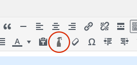

## omCleaner

This Wordpress plugin has similar functionality as PASTE without formatting,
but preserve semantic tags like `<strong>`, `<pre>` etc.

omCleaner is smart and only remove unwanted wrappers (div, span) and
attributes (id, class, style) from your HTML code :-)

PS: it's one button in wysiwyg editor

